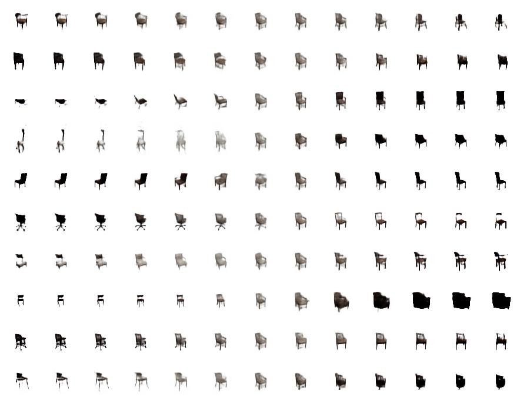
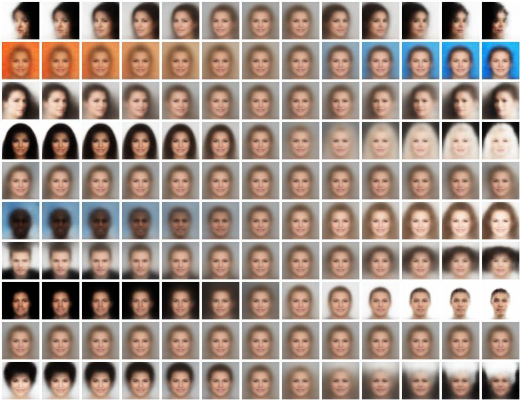

# β-VAE
Pytorch implementation of β-VAE proposed in [this paper]
<br>

### Dependencies
```
python 3.6.4
pytorch 0.3.1.post2
visdom
```
<br>

### Datasets
[same with here]

### Usage
initialize visdom
```
python -m visdom.server -p 55558
```
you can run codes using sh files
```
e.g.
sh run_celeba.sh
sh run_3dchairs.sh
```
or you can run your own experiments by setting parameters manually
```
e.g.
python main.py --beta 4 --lr 1e-4 --z_dim 32 ...
```
check training process on the visdom server
```
localhost:55558
```
<br>

### Results
#### 3D Chairs latent space traverse. z was sampled from N(0,I)

#### CelebA latent space traverse. z was sampled from N(0,I)



### Reference
1. β-VAE: Learning Basic Visual Concepts with a Constrained Variational Framework, Higgins et al.

[this paper]: https://openreview.net/pdf?id=Sy2fzU9gl
[same with here]: https://github.com/1Konny/FactorVAE
