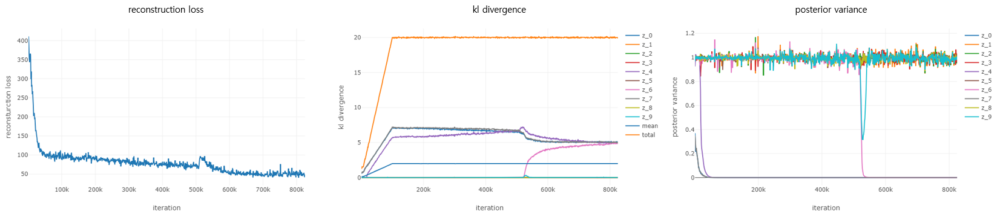

# β-VAE
Pytorch reproduction of two papers below:
1. [β-VAE: Learning Basic Visual Concepts with a Constrained Variational Framework, Higgins et al., ICLR, 2017]
2. [Understanding disentangling in β-VAE, Burgess et al., arxiv:1804.03599, 2018]
<br>

### Dependencies
```
python 3.6.4
pytorch 0.3.1.post2
visdom
```
<br>

### Datasets
[same with here]
<br>

### Usage
initialize visdom
```
python -m visdom.server
```
you can run codes using sh files
```
e.g.
sh run_celeba_H.sh
sh run_3dchairs_H.sh
sh run_dsprites_B.sh
```
or you can run your own experiments by setting parameters manually
```
e.g.
python main.py --beta 4 --lr 1e-4 --z_dim 32 ...
```
check training process on the visdom server
```
localhost:8097
```
<br>

### Results
#### 3D Chairs
```
sh run_celeba_H.sh
```

#### CelebA
```
sh run_3dchairs_H.sh
```

#### dSprites
```
sh run_dsprites_B.sh
```



### Reference
1. [β-VAE: Learning Basic Visual Concepts with a Constrained Variational Framework, Higgins et al., ICLR, 2017]
2. [Understanding disentangling in β-VAE, Burgess et al., arxiv:1804.03599, 2018]
3. [Github Repo]: Tensorflow implementation from [miyosuda]

[β-VAE: Learning Basic Visual Concepts with a Constrained Variational Framework, Higgins et al., ICLR, 2017]: https://openreview.net/pdf?id=Sy2fzU9gl
[Understanding disentangling in β-VAE, Burgess et al., arxiv:1804.03599, 2018]: http://arxiv.org/abs/1804.03599
[same with here]: https://github.com/1Konny/FactorVAE
[Github Repo]: https://github.com/miyosuda/disentangled_vae
[miyosuda]: https://github.com/miyosuda
